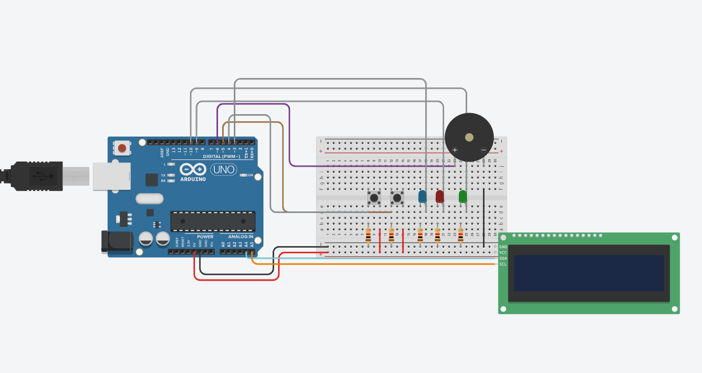

# ⏱️ Embedded Pomodoro Timer

A smart productivity timer built with C++ and Arduino using the Pomodoro technique. The project is designed using a Finite State Machine (FSM) and features non-blocking timing logic for optimal responsiveness.

## 🛠️ Circuit Diagram

## 🚀 Key Features
- **Non-blocking Architecture:** Utilizes `millis()` instead of `delay()` to handle real-time button inputs simultaneously.
- **Finite State Machine (FSM):** Efficiently manages system transitions between Welcome, Work, and Break states.
- **Hardware Integration:** Features an I2C LCD (16x2), RGB notification LEDs, and a piezo buzzer for audio alerts.

## 💻 Tech Stack
- **Language:** C++
- **Platform:** Arduino
- **Protocols:** I2C (for LCD display)
